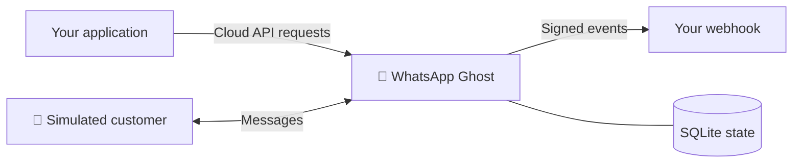

<div align="center">

# 👻 WhatsApp Ghost

**A persistent local sandbox for the WhatsApp Cloud API**

Build, test, and debug WhatsApp integrations without contacting real users or waiting on external services.

[](https://www.python.org/)
[](https://fastapi.tiangolo.com/)
[](pyproject.toml)
[](contracts/v25.0/README.md)

[Quick start](#quick-start) · [Connect your app](#connect-your-app) · [Webhooks](#webhooks) · [Configuration](#configuration) · [Development](#development)

</div>

---

WhatsApp Ghost imitates the documented WhatsApp Cloud API contracts that developers commonly integrate with. Change only the hostname in your application:

```text
https://graph.facebook.com  →  http://127.0.0.1:8787
```

> [!IMPORTANT]
> WhatsApp Ghost is an independent development tool. It is not WhatsApp, does not connect to WhatsApp users, and does not implement Meta's private protocols.

## ✨ What you get

| | Capability | What it lets you test |
|:--:|---|---|
| 💬 | **Messages** | Text, media, templates, replies, and realistic `wamid` values |
| 📱 | **Phone simulators** | Customer conversations in the browser or terminal |
| 🪝 | **Webhooks** | Signed payloads, delivery history, inspection, and replay |
| ✅ | **Delivery lifecycle** | `sent`, `delivered`, `read`, and `failed` status transitions |
| 🧩 | **Accounts and senders** | Local apps, WABAs, tokens, and multiple business numbers |
| ⏰ | **Time travel** | Test the 24-hour customer-service window in seconds |
| 💾 | **Persistent state** | Shared SQLite state across the API, console, and phones |
| 🎛️ | **Testing modes** | Strict and loose validation for different integration stages |



<a id="quick-start"></a>

## 🚀 Quick start

Install [uv](https://docs.astral.sh/uv/) and run this from the project folder:

```powershell
uv sync
uv run ghost.py start
```

No configuration is required. Once the server is running, choose an interface:

| Destination | URL | Purpose |
|---|---|---|
| Developer console | [localhost:8787](http://127.0.0.1:8787) | Manage local apps, WABAs, senders, templates, webhooks, and time |
| Integration guide | [localhost:8787/guide](http://127.0.0.1:8787/guide) | Follow live, copyable examples |
| API reference | [localhost:8787/docs](http://127.0.0.1:8787/docs) | Explore and call the API interactively |
| Phone simulator | [localhost:8787/phone](http://127.0.0.1:8787/phone) | Chat as a simulated customer |

Or open the Textual phone in another terminal:

```powershell
uv run ghost.py phone open 15550002001
```

<details>
<summary><strong>Default local identities</strong></summary>

<br>

| Resource | Value |
|---|---|
| Access token | `local-dev-token` |
| App secret | `local-app-secret` |
| Verify token | `local-verify-token` |
| Business | `BUSINESS_LOCAL` |
| WABA | `WABA_LOCAL` |
| Phone number ID | `PHONE_LOCAL` |
| Business number | `15550001000` |
| Simulated customer | `15550002001` |
| API version used in examples | `v25.0` |

</details>

Run `uv run ghost.py doctor` if startup does not work. An installed `waba` command is also provided, but `ghost.py` works on Windows machines whose application-control policy blocks generated command launchers.

The web console and terminal phone share the same SQLite state, so a conversation started in either interface appears in both. The visual language is WhatsApp-inspired and internally branded as Ghost; it is intentionally not a copy of Meta's site or trademarks.

<a id="connect-your-app"></a>

## 🔌 Connect your app

Keep your existing Cloud API code and change its configuration:

```text
META_GRAPH_BASE_URL=http://127.0.0.1:8787
WHATSAPP_API_VERSION=v25.0
WHATSAPP_PHONE_NUMBER_ID=PHONE_LOCAL
WHATSAPP_ACCESS_TOKEN=local-dev-token
WHATSAPP_APP_SECRET=local-app-secret
```

A normal request to `https://graph.facebook.com/v25.0/{PHONE_NUMBER_ID}/messages` therefore becomes `http://127.0.0.1:8787/v25.0/PHONE_LOCAL/messages`; the path, headers, request JSON, response parsing, and `wamid` handling remain the same.

To test your project's webhook without commands:

1. Start your project and expose its local callback, such as `http://127.0.0.1:3000/webhook`.
2. Open **Webhooks** in the Ghost console, select the WABA, enter the callback and your project's verify token, then click **Verify and subscribe**.
3. Open **Phone Simulator**, select or create a customer, and send a message.
4. Your project receives the inbound message payload. Business replies sent by your project produce `sent`, `delivered`, `read`, or `failed` status payloads at the same callback.
5. Inspect signatures and raw payloads—or replay a delivery—from the console's Webhook Inspector.

The phone selector lets you switch among all simulated customers. You may also open the console in several browser windows or use separate Textual terminals for simultaneous users.

### Multiple sender numbers

One WABA can own multiple business sender numbers. In **API Setup & Numbers**, create a business and then use **Add sender** on its card for each additional number. Retrieve all of them through the compatible route:

```http
GET /v25.0/{WABA_ID}/phone_numbers
```

Choose the sender by placing its phone-number ID in the message URL: `POST /v25.0/{PHONE_NUMBER_ID}/messages`. There is no `from` field. Templates and webhook subscription are shared at WABA scope; sender identity, message history, ticks, and the 24-hour window are isolated for each sender/customer pair. Ghost does not impose Meta account-tier number quotas on local test rows.

## 🧪 Your first complete conversation

The sandbox starts in strict mode. Like the real platform, a free-form business message is rejected until the customer has opened the 24-hour service window. Send a customer message from the Textual phone, or use:

```powershell
Invoke-RestMethod -Method Post `
  -Uri http://127.0.0.1:8787/_sandbox/phones/15550002001/messages `
  -ContentType application/json `
  -Body '{"type":"text","text":"Hello from my phone"}'
```

Now use the same Cloud API request your application would use:

```powershell
$headers = @{ Authorization = "Bearer local-dev-token" }
$body = @{
  messaging_product = "whatsapp"; recipient_type = "individual"
  to = "15550002001"; type = "text"
  text = @{ body = "Hello from the business"; preview_url = $false }
} | ConvertTo-Json -Depth 5
Invoke-RestMethod -Method Post `
  -Uri http://127.0.0.1:8787/v25.0/PHONE_LOCAL/messages `
  -Headers $headers -ContentType application/json -Body $body
```

The response contains a `wamid.*` ID. The message progresses through `accepted → sent → delivered → read`; opening the conversation in a simulated phone marks delivered business messages read and emits the corresponding status webhook. Customer-side bubbles show single, double-grey, double-blue, and failure indicators from the stored status.

Outside the service window, the seeded approved template works:

```json
{
  "messaging_product": "whatsapp",
  "to": "15550002001",
  "type": "template",
  "template": {
    "name": "hello_world",
    "language": {"code": "en_US"},
    "components": [{"type": "body", "parameters": [{"type": "text", "text": "Ranit"}]}]
  }
}
```

<a id="webhooks"></a>

## 🪝 Webhooks

Run the included receiver in a separate terminal:

```powershell
uv run uvicorn examples.webhook_receiver:app --port 9000
```

Subscribe its callback:

```powershell
$headers = @{ Authorization = "Bearer local-dev-token" }
Invoke-RestMethod -Method Post `
  -Uri http://127.0.0.1:8787/v25.0/WABA_LOCAL/subscribed_apps `
  -Headers $headers -ContentType application/json `
  -Body '{"callback_url":"http://127.0.0.1:9000/webhook"}'
```

Webhook bodies use the documented `whatsapp_business_account → entry → changes → value` envelope. `X-Hub-Signature-256` is an HMAC-SHA256 digest of the exact raw body using `local-app-secret`. Every event is stored before delivery. The web inspector retains every replay attempt with timestamps, HTTP status, response/error, destination, signature, and syntax-highlighted request JSON. Inspect from the console or with `uv run ghost.py webhooks list`.

The standard verification endpoint is `GET /webhook` with `hub.mode`, `hub.verify_token`, and `hub.challenge` parameters.

## 🖼️ Media and templates

Supported media flow:

1. `POST /v25.0/PHONE_LOCAL/media` as multipart form with `messaging_product=whatsapp` and `file`.
2. `GET /v25.0/{media-id}` to receive metadata and a temporary-style local URL.
3. `GET /_sandbox/media/{media-id}` with the Bearer token to download bytes.
4. `DELETE /v25.0/{media-id}`.

Outbound messages accept image, video, audio, document, and sticker references by uploaded `id` or external `link`. The Textual client renders useful attachment placeholders.

Template routes:

```text
GET    /v25.0/{waba-id}/message_templates
POST   /v25.0/{waba-id}/message_templates
GET    /v25.0/{template-id}
DELETE /v25.0/{template-id}
DELETE /v25.0/{waba-id}/message_templates?name={name}
```

New local templates auto-approve. Send `"_sandbox_auto_approve": false` during creation to test `PENDING`; that underscore-prefixed field is a simulator extension.

## ⏱️ Time travel and multiple phones

```powershell
uv run ghost.py clock show
uv run ghost.py clock advance 25h
uv run ghost.py clock set 2026-07-15T10:00:00Z
uv run ghost.py clock reset
uv run ghost.py phone create 15550002002 --name Alice
uv run ghost.py phone spawn 15550002002
```

Each inbound message resets only that customer/business-phone pair's window. One simulated customer can independently chat with every configured business: choose a business in the dedicated `/phone` tab, and the first message creates that conversation, emits the correct WABA webhook, and opens its 24-hour window. `spawn` opens another terminal on Windows; `open` runs in the current terminal.

The Textual client also loads every configured sender. Use the contact list to switch businesses, or open a specific sender directly:

```powershell
uv run ghost.py phone open 15550002001 --business PHONE_LOCAL
uv run ghost.py phone spawn 15550002002 --business PHONE_SALES
```

<a id="configuration"></a>

## ⚙️ Modes and configuration

Defaults work immediately. `.env` is loaded automatically; `.env.example` documents the settings:

| Variable | Default | Meaning |
|---|---|---|
| `WABA_DATA_DIR` | `.whatsapp-ghost` | SQLite and media directory |
| `WABA_BASE_URL` | `http://127.0.0.1:8787` | API URL used by responses and CLI |
| `WABA_ACCESS_TOKEN` | `local-dev-token` | Accepted Bearer token |
| `WABA_APP_SECRET` | `local-app-secret` | Webhook signing secret |
| `WABA_VERIFY_TOKEN` | `local-verify-token` | Webhook challenge token |
| `WABA_MODE` | `strict` | `strict`, `loose`, or `chaos` |
| `WABA_STATUS_DELAY` | `0.05` | Seconds before delivery |
| `WABA_NOTIFY` | `bell` | `bell`, `desktop`, or `none` |

`strict` enforces recipient existence and the service window. `loose` optimizes early integration and infers an omitted message type when unambiguous. `chaos` is reserved for deterministic fault policies; it currently uses strict validation and does not inject random failures. Reset safely with `uv run ghost.py reset`.

## 🧰 Sandbox control API

Everything below `/_sandbox` is intentionally not Meta-compatible: health/config/reset, virtual clock, phones and inbound messages, message/status inspection, webhook inspection/replay, media downloads, and the client WebSocket. This separation prevents test conveniences from leaking into the compatibility surface.

## 🎯 Fidelity and current boundary

Implemented behavior is based on Meta's documented Cloud API and official Postman examples, plus the supplied saved references. The goal is contract-compatible behavior for documented and tested scenarios. IDs, delivery timing, opaque implementation details, policy enforcement, and some error wording are approximations.

The first release does not yet implement Flows execution, commerce/catalogs, payments, QR codes, resumable template-media uploads, analytics, embedded signup, throughput token buckets, seven-day retry scheduling, automatic template-review delays, pricing cutovers, or a differential runner against an authorized Meta account. The boundaries allow those to be added without duplicating message rules.

> [!CAUTION]
> Do not use this project to impersonate WhatsApp, connect unauthorized accounts, or test undocumented private protocols.

<a id="development"></a>

## 🛠️ Development

```powershell
uv sync
uv run playwright install chromium
uv run pytest -q
uv run pytest --cov=whatsapp_ghost --cov-report=term-missing
```

The suite is split by behavior: resources/authentication, messages and 24-hour windows, media persistence/ownership, templates, webhooks and real callback delivery, restart/reset persistence, CLI, browser UI, and Textual UI. Browser tests start an actual Uvicorn process and drive Chromium through the console and phone—including image attachment, filesystem persistence, message ordering, ticks, and sender switching.

SQLite uses WAL mode. Original message payloads, status events, media metadata, and raw signed webhook bodies persist under `.whatsapp-ghost/`. Browser phone attachments use the same upload → media ID → message-reference flow as the API; they are stored in `.whatsapp-ghost/media/`, never embedded as transient data URLs.
